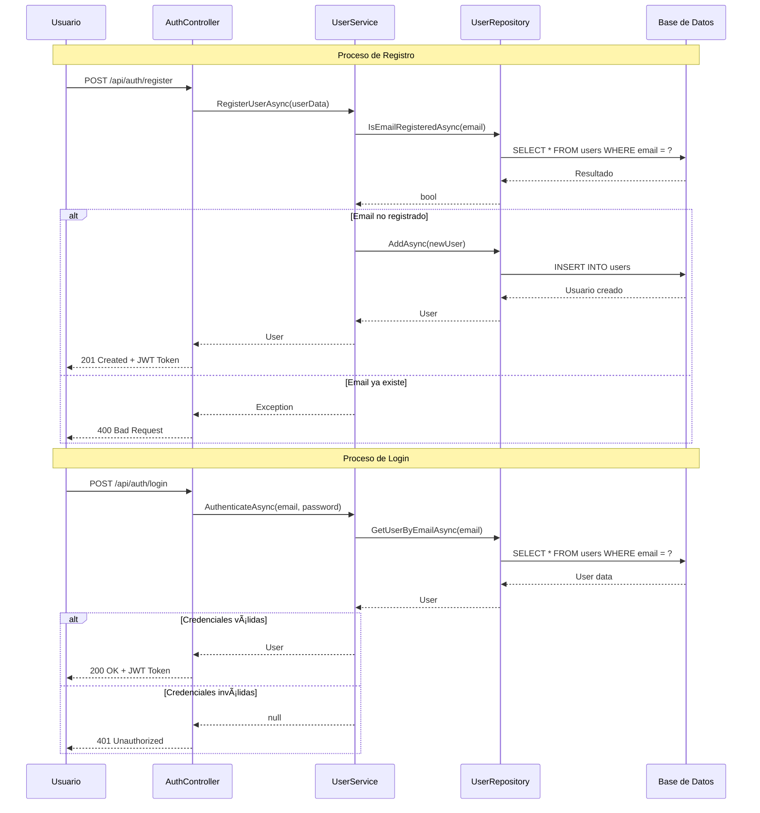
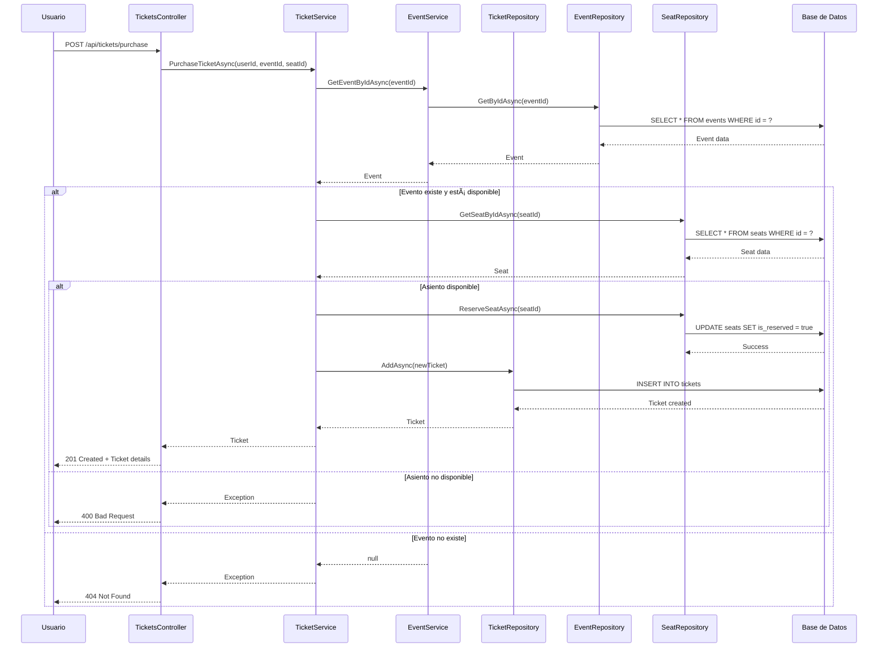
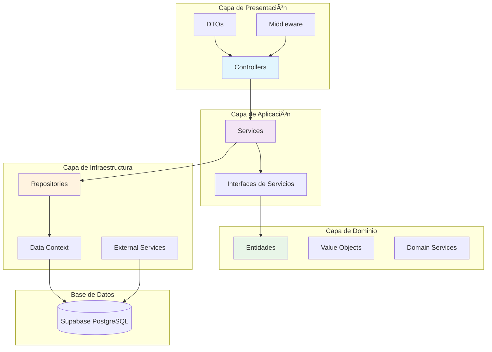

# Diagrama de Clases - Aplicacion Event Ticketing

Este diagrama muestra la estructura de clases para la aplicacion de venta de entradas para eventos, incluyendo las entidades principales y sus relaciones.

## Diagrama de Clases Principal

```mermaid
classDiagram
    class User {
        +Guid Id
        +string Email
        +string PasswordHash
        +string FirstName
        +string LastName
        +string PhoneNumber
        +DateTime RegistrationDate
        +UserRole Role
        +List~Ticket~ Tickets
        
        +UpdateProfile(firstName, lastName, phoneNumber)
        +ChangeRole(role)
        +GetFullName() string
    }

    class Event {
        +Guid Id
        +string Name
        +string Description
        +DateTime Date
        +string Location
        +string Category
        +int TotalCapacity
        +decimal BasePrice
        +bool HasNumberedSeats
        +Guid OrganizerId
        +List~Ticket~ IssuedTickets
        +List~Seat~ Seats
        
        +UpdateDetails(name, description, location)
        +GetAvailableSeats() int
        +CalculatePrice(seatId) decimal
    }

    class Ticket {
        +Guid Id
        +Guid EventId
        +Guid UserId
        +DateTime PurchaseDate
        +decimal Price
        +string Code
        +bool IsUsed
        +Guid? SeatId
        +string SeatRow
        +int SeatNumber
        +string SeatSection
        
        +MarkAsUsed()
        +GenerateQRCode() string
        +ValidateTicket() bool
    }

    class Seat {
        +Guid Id
        +Guid EventId
        +string Row
        +int Number
        +string Section
        +decimal PriceMultiplier
        +bool IsReserved
        
        +Reserve()
        +Release()
        +CalculateFinalPrice(basePrice) decimal
    }

    class UserRole {
        <<enumeration>>
        Customer
        Organizer
        Administrator
    }

    %% DTOs
    class UserDto {
        +Guid Id
        +string Email
        +string FirstName
        +string LastName
        +string Role
    }

    class EventDto {
        +Guid Id
        +string Name
        +string Description
        +DateTime Date
        +string Location
        +string Category
        +decimal BasePrice
        +bool HasNumberedSeats
        +int AvailableSeats
    }

    class TicketDto {
        +Guid Id
        +Guid EventId
        +string EventName
        +DateTime EventDate
        +string EventLocation
        +DateTime PurchaseDate
        +decimal Price
        +string Code
        +bool IsUsed
        +SeatInfoDto SeatInfo
    }

    %% Repositories
    class IUserRepository {
        <<interface>>
        +GetUserByEmailAsync(email) Task~User~
        +GetUsersByRoleAsync(role) Task~IEnumerable~User~~
        +IsEmailRegisteredAsync(email) Task~bool~
        +GetUserWithTicketsAsync(userId) Task~User~
    }

    class IEventRepository {
        <<interface>>
        +GetEventsAsync() Task~IEnumerable~Event~~
        +GetEventByIdAsync(id) Task~Event~
        +GetEventsByDateRangeAsync(start, end) Task~IEnumerable~Event~~
        +GetEventsByCategoryAsync(category) Task~IEnumerable~Event~~
    }

    class ITicketRepository {
        <<interface>>
        +GetTicketsByUserAsync(userId) Task~IEnumerable~Ticket~~
        +GetTicketsByEventAsync(eventId) Task~IEnumerable~Ticket~~
        +GetTicketByCodeAsync(code) Task~Ticket~
    }

    %% Services
    class IUserService {
        <<interface>>
        +RegisterUserAsync(email, password, firstName, lastName, phoneNumber, role) Task~User~
        +AuthenticateAsync(email, password) Task~User~
        +UpdateProfileAsync(userId, firstName, lastName, phoneNumber) Task~User~
        +GetUserByIdAsync(userId) Task~User~
    }

    class IEventService {
        <<interface>>
        +CreateEventAsync(eventDto) Task~Event~
        +GetEventsAsync() Task~IEnumerable~Event~~
        +GetEventByIdAsync(eventId) Task~Event~
        +UpdateEventAsync(eventId, eventDto) Task~Event~
        +DeleteEventAsync(eventId) Task
    }

    class ITicketService {
        <<interface>>
        +PurchaseTicketAsync(userId, eventId, seatId) Task~Ticket~
        +GetUserTicketsAsync(userId) Task~IEnumerable~Ticket~~
        +ValidateTicketAsync(code) Task~bool~
        +GetTicketByIdAsync(ticketId) Task~Ticket~
    }

    %% Controllers
    class AuthController {
        -IUserService _userService
        +Register(registerDto) Task~IActionResult~
        +Login(loginDto) Task~IActionResult~
    }

    class EventsController {
        -IEventService _eventService
        +GetEvents() Task~IActionResult~
        +GetEvent(id) Task~IActionResult~
        +CreateEvent(eventDto) Task~IActionResult~
        +UpdateEvent(id, eventDto) Task~IActionResult~
        +DeleteEvent(id) Task~IActionResult~
    }

    class TicketsController {
        -ITicketService _ticketService
        +PurchaseTicket(purchaseDto) Task~IActionResult~
        +GetUserTickets() Task~IActionResult~
        +ValidateTicket(code) Task~IActionResult~
    }

    %% Relaciones de Dominio
    User ||--o{ Ticket : "compra"
    User ||--|| UserRole : "tiene"
    Event ||--o{ Ticket : "genera"
    Event ||--o{ Seat : "contiene"
    Seat ||--o| Ticket : "asignado_a"
    
    %% Relaciones de Servicios
    AuthController --> IUserService
    EventsController --> IEventService
    TicketsController --> ITicketService
    
    %% Relaciones de Repositorios
    IUserService --> IUserRepository
    IEventService --> IEventRepository
    ITicketService --> ITicketRepository
```

## Diagrama de Secuencia - Registro y Autenticación



## Diagrama de Secuencia - Compra de Entradas



## Arquitectura por Capas



## Patrones de Diseño Implementados

### 1. Repository Pattern
- **Propósito**: Encapsula la lógica de acceso a datos
- **Implementación**: `IUserRepository`, `IEventRepository`, `ITicketRepository`
- **Beneficios**: Separación de responsabilidades, testabilidad

### 2. Service Layer Pattern
- **Propósito**: Encapsula la lógica de negocio
- **Implementación**: `UserService`, `EventService`, `TicketService`
- **Beneficios**: Reutilización de código, mantenibilidad

### 3. Data Transfer Object (DTO)
- **Propósito**: Transferencia de datos entre capas
- **Implementación**: `UserDto`, `EventDto`, `TicketDto`
- **Beneficios**: Desacoplamiento, control de datos expuestos

### 4. Dependency Injection
- **Propósito**: Inversión de control y gestión de dependencias
- **Implementación**: Interfaces inyectadas en constructores
- **Beneficios**: Testabilidad, flexibilidad, bajo acoplamiento

### 5. Domain-Driven Design (DDD)
- **Propósito**: Modelado del dominio de negocio
- **Implementación**: Entidades ricas, value objects, servicios de dominio
- **Beneficios**: Código expresivo, mantenibilidad

## Principios SOLID

### Single Responsibility Principle (SRP)
- Cada clase tiene una única responsabilidad
- `UserService` solo maneja operaciones de usuario
- `TicketService` solo maneja operaciones de tickets

### Open/Closed Principle (OCP)
- Clases abiertas para extensión, cerradas para modificación
- Uso de interfaces permite extensibilidad sin modificar código existente

### Liskov Substitution Principle (LSP)
- Las implementaciones pueden sustituir a sus interfaces
- Cualquier implementación de `IUserRepository` puede usarse indistintamente

### Interface Segregation Principle (ISP)
- Interfaces específicas y cohesivas
- `IUserService`, `IEventService`, `ITicketService` son interfaces especializadas

### Dependency Inversion Principle (DIP)
- Dependencia de abstracciones, no de concreciones
- Controllers dependen de interfaces de servicios, no de implementaciones concretas

---

*Diagrama generado automaticamente para la aplicación Event Ticketing*
*Fecha de generacion: $(Get-Date -Format "yyyy-MM-dd HH:mm:ss")*
