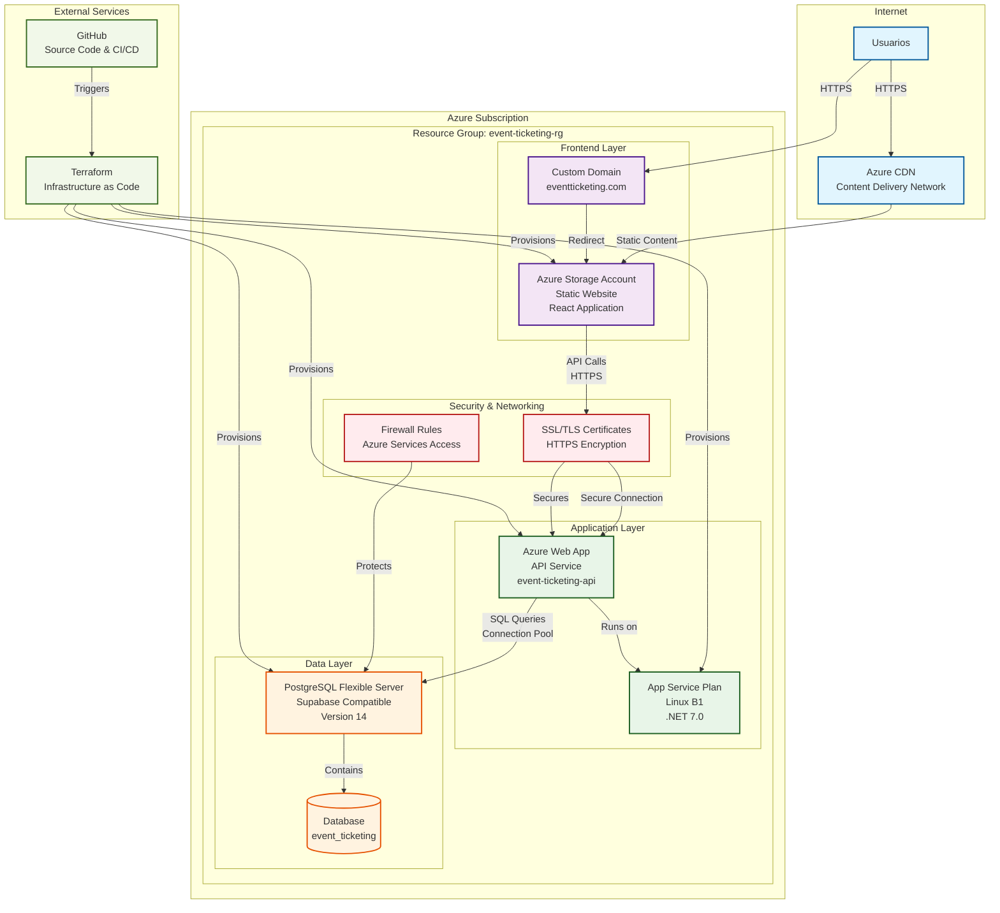
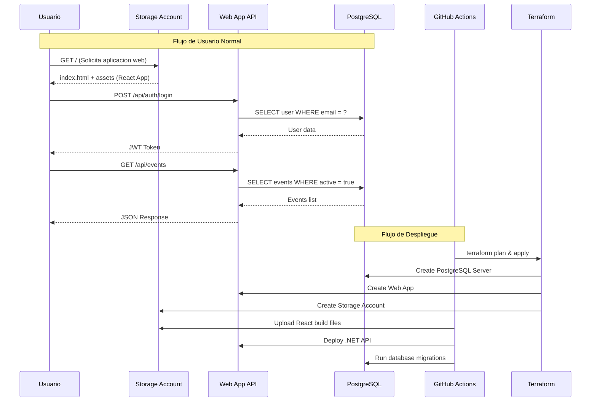

# Diagrama de Infraestructura - Event Ticketing Application

Este diagrama muestra la arquitectura de infraestructura en Azure para la aplicacion de venta de entradas para eventos.

## Arquitectura de Infraestructura en Azure



## Diagrama de Despliegue Detallado

```mermaid
flowchart TD
    subgraph "Azure Cloud Platform"
        subgraph "Resource Group: event-ticketing-rg"
            subgraph "Frontend Tier"
                SA[Storage Account<br/>Static Website<br/>React SPA]
            end
            
            subgraph "Application Tier"
                ASP[App Service Plan<br/>Linux B1]
                API[Web App<br/>.NET 7 API<br/>Always On]
                ASP --> API
            end
            
            subgraph "Data Tier"
                PG[PostgreSQL Server<br/>Flexible Server<br/>Version 14]
                DB[(Database<br/>event_ticketing<br/>32GB Storage)]
                PG --> DB
            end
        end
    end
    
    subgraph "Development & Operations"
        DEV[Developer Machine<br/>Terraform CLI]
        GHA[GitHub Actions<br/>CI/CD Pipeline]
    end
    
    subgraph "End Users"
        USERS[Web Users<br/>Mobile Users]
    end
    
    USERS -->|HTTPS Requests| SA
    SA -->|API Calls| API
    API -->|SQL Queries| PG
    DEV -->|terraform apply| "Resource Group: event-ticketing-rg"
    GHA -->|Deploy Code| API
    GHA -->|Upload Assets| SA
```

## Flujo de Datos y Comunicacion



## Configuracion de Recursos Azure

### Storage Account (Frontend)
- **Nombre**: eventticketing{random}
- **Tipo**: StorageV2 con Static Website
- **Replicacion**: LRS (Locally Redundant Storage)
- **Configuracion**:
  - Index document: index.html
  - Error 404 document: index.html
- **CORS**: Configurado para API calls

### App Service (Backend API)
- **Nombre**: event-ticketing-api-{random}
- **Plan**: Linux B1 (Basic, 1 Core, 1.75GB RAM)
- **Runtime**: .NET 7.0
- **Configuracion**:
  - Always On: Habilitado
  - ASPNETCORE_ENVIRONMENT: Production
  - Connection String: PostgreSQL
  - CORS_ORIGINS: Storage Account URL

### PostgreSQL Flexible Server
- **Nombre**: supabase-pg-{random}
- **Version**: PostgreSQL 14
- **SKU**: B_Standard_B1ms (Burstable)
- **Storage**: 32 GB
- **Configuracion**:
  - Backup retention: 7 dias
  - Charset: UTF8
  - Collation: en_US.utf8

## Consideraciones de Seguridad

### 1. Comunicacion Segura
- **HTTPS Only**: Todas las comunicaciones externas
- **TLS 1.2+**: Conexiones a base de datos encriptadas
- **CORS Policy**: Configurado especificamente para el dominio frontend

### 2. Acceso a Base de Datos
- **Firewall Rules**: Solo Azure Services permitidos (0.0.0.0)
- **Authentication**: Usuario/contrasena administrados
- **Network Security**: Sin acceso publico directo

### 3. Gestion de Secretos
- **App Settings**: Variables sensibles en configuracion segura
- **Connection Strings**: Almacenadas en App Service Configuration
- **Terraform State**: Backend remoto recomendado

## Escalabilidad y Rendimiento

### Escalabilidad Automatica
- **App Service**: Scale up/out disponible
- **PostgreSQL**: Escalado vertical de compute y storage
- **Storage Account**: Escalado automatico ilimitado

### Optimizaciones de Rendimiento
- **Static Content**: Servido directamente desde Storage
- **API Caching**: Headers de cache configurables
- **Database**: Connection pooling en .NET
- **Compression**: Gzip habilitado automaticamente

## Estimacion de Costos (USD/mes)

| Recurso | SKU/Tier | Uso Estimado | Costo Mensual |
|---------|----------|--------------|---------------|
| App Service Plan | B1 Linux | 24/7 | ~$13.14 |
| PostgreSQL Flexible | B1ms | 24/7 | ~$12.41 |
| Storage Account | Standard LRS | 1GB + transactions | ~$2.00 |
| Bandwidth | Outbound | 10GB | ~$0.87 |
| **Total Estimado** | | | **~$28.42** |

*Precios basados en region West US, pueden variar*

## Comandos de Gestion

### Terraform - Infraestructura
```bash
# Inicializar Terraform
cd terraform
terraform init

# Planificar cambios
terraform plan -var="subscription_id=YOUR_SUB_ID"

# Aplicar infraestructura
terraform apply -auto-approve

# Destruir recursos (cuidado!)
terraform destroy
```

### Azure CLI - Gestion Manual
```bash
# Login a Azure
az login

# Listar recursos del grupo
az resource list --resource-group event-ticketing-rg-XXX

# Ver logs de Web App
az webapp log tail --name event-ticketing-api-XXX --resource-group event-ticketing-rg-XXX

# Escalar App Service
az appservice plan update --name event-ticketing-plan-XXX --resource-group event-ticketing-rg-XXX --sku B2
```

---

*Diagrama de infraestructura generado automaticamente*
*Basado en configuracion Terraform: /terraform/main.tf*
