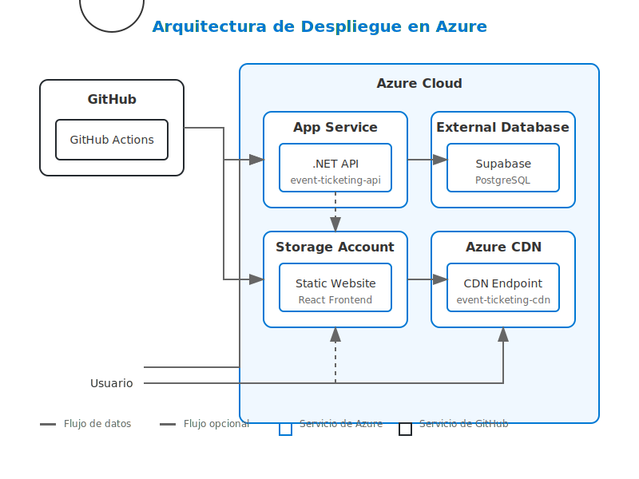

# Guía de Despliegue en Azure con GitHub Actions



## Requisitos Previos

1. Una cuenta de Azure con una suscripción activa
2. Una cuenta de GitHub con acceso al repositorio
3. Permisos para crear recursos en Azure
4. Azure CLI instalado localmente (opcional, para configuración manual)
5. PowerShell 5.1 o superior (para usar el script de configuración automatizada)

## Configuración de Recursos en Azure

### Opción 1: Configuración Automatizada (Recomendada)

Hemos proporcionado un script de PowerShell que automatiza la creación de todos los recursos necesarios en Azure:

1. Abre PowerShell como administrador
2. Navega al directorio del proyecto
3. Ejecuta el script:

```powershell
.\scripts\setup-azure.ps1
```

El script creará automáticamente:
- Grupo de recursos
- Plan de App Service
- Web App para la API
- Cuenta de almacenamiento con sitio web estático habilitado para el frontend
- Perfil de CDN y endpoint (opcional)
- Service Principal para GitHub Actions (opcional)

Además, el script generará las credenciales necesarias para configurar los secretos en GitHub.

### Opción 2: Configuración Manual

Si prefieres crear los recursos manualmente, sigue estos pasos:

#### 1. Azure App Service
Para alojar la API de backend:

```bash
# Usando Azure CLI
az group create --name EventTicketingRG --location eastus
az appservice plan create --name EventTicketingPlan --resource-group EventTicketingRG --sku B1
az webapp create --name event-ticketing-api --resource-group EventTicketingRG --plan EventTicketingPlan
```

#### 2. Azure Storage Account
Para alojar la aplicación frontend de React:

```bash
# Usando Azure CLI
az storage account create --name eventticketingstore --resource-group EventTicketingRG --location eastus --sku Standard_LRS --kind StorageV2
az storage blob service-properties update --account-name eventticketingstore --static-website --index-document index.html --404-document index.html
```

#### 3. Azure CDN (Opcional)
Para mejorar el rendimiento del frontend:

```bash
# Usando Azure CLI
az cdn profile create --name EventTicketingCDN --resource-group EventTicketingRG --sku Standard_Microsoft
az cdn endpoint create --name event-ticketing-cdn --profile-name EventTicketingCDN --resource-group EventTicketingRG --origin-host-name eventticketingstore.z13.web.core.windows.net --origin-name eventticketingstore
```

## Configuración de Secretos en GitHub

Para que el flujo de trabajo de GitHub Actions funcione correctamente, debes configurar varios secretos en tu repositorio.

Consulta el documento detallado [Variables de Entorno para Azure](azure_environment_variables.md) que incluye:

- Lista completa de secretos necesarios para GitHub Actions
- Variables de entorno para la aplicación
- Variables para notificaciones
- Instrucciones para configurar variables en Azure App Service
- Comandos para obtener valores como claves de almacenamiento

### Resumen de Secretos Principales

| Categoría | Secretos Clave |
|-----------|---------------|
| **Azure** | `AZURE_CREDENTIALS`, `AZURE_WEBAPP_NAME`, `AZURE_STORAGE_ACCOUNT`, `AZURE_STORAGE_KEY` |
| **Aplicación** | `SUPABASE_CONNECTION_STRING`, `JWT_SECRET_KEY`, `REACT_APP_API_URL` |
| **Notificaciones** | `SLACK_WEBHOOK_URL` (opcional) |

Para configurar estos secretos:

1. Ve a la configuración de tu repositorio en GitHub > Settings > Secrets and variables > Actions
2. Añade cada secreto con su valor correspondiente

## Obtener Credenciales de Azure

Para obtener el valor de `AZURE_CREDENTIALS`, ejecuta el siguiente comando con Azure CLI:

```bash
az ad sp create-for-rbac --name "EventTicketingGitHubActions" --role contributor --scopes /subscriptions/{subscription-id}/resourceGroups/{resource-group} --sdk-auth
```

Copia la salida JSON completa y guárdala como el valor del secreto `AZURE_CREDENTIALS` en GitHub.

## Verificación del Despliegue

Una vez que el flujo de trabajo de GitHub Actions se haya ejecutado correctamente:

1. La API estará disponible en: `https://{AZURE_WEBAPP_NAME}.azurewebsites.net`
2. El frontend estará disponible en: `https://{AZURE_STORAGE_ACCOUNT}.z13.web.core.windows.net` o a través del CDN en `https://{AZURE_CDN_ENDPOINT_NAME}.azureedge.net`

## Solución de Problemas y Optimizaciones

Para una guía completa sobre solución de problemas, optimizaciones y preguntas frecuentes, consulta nuestro [FAQ de Despliegue en Azure](azure_deployment_faq.md).

### Resumen de Solución de Problemas

1. **Error de autenticación**: Verifica las credenciales en `AZURE_CREDENTIALS` y regenera el Service Principal si es necesario.

2. **Problemas de despliegue del frontend**: Asegúrate de que la cuenta de almacenamiento tenga habilitado el sitio web estático.

3. **Problemas de conexión a la base de datos**: Verifica la cadena de conexión y las reglas de firewall.

4. **Problemas de CORS**: Configura correctamente las políticas CORS en la API.

### Monitoreo

1. **Logs de GitHub Actions**: Pestaña "Actions" en tu repositorio de GitHub.

2. **Logs de Azure**:
   - API: Portal de Azure > App Service > Logs
   - Frontend: Portal de Azure > Storage Account > Monitoring

## Recursos Adicionales

- [Documentación de Azure App Service](https://docs.microsoft.com/es-es/azure/app-service/)
- [Documentación de GitHub Actions](https://docs.github.com/es/actions)
- [Documentación de Azure Storage](https://docs.microsoft.com/es-es/azure/storage/)
- [Documentación de Azure CDN](https://docs.microsoft.com/es-es/azure/cdn/)

## Próximos Pasos

1. **Configurar dominios personalizados**: Mejora la profesionalidad con dominios propios.

2. **Implementar CI/CD avanzado**: Añade pruebas automatizadas y despliegues por entornos.

3. **Configurar monitoreo**: Implementa Azure Application Insights para seguimiento detallado.

4. **Optimizar costos**: Revisa y ajusta los recursos según el uso real.